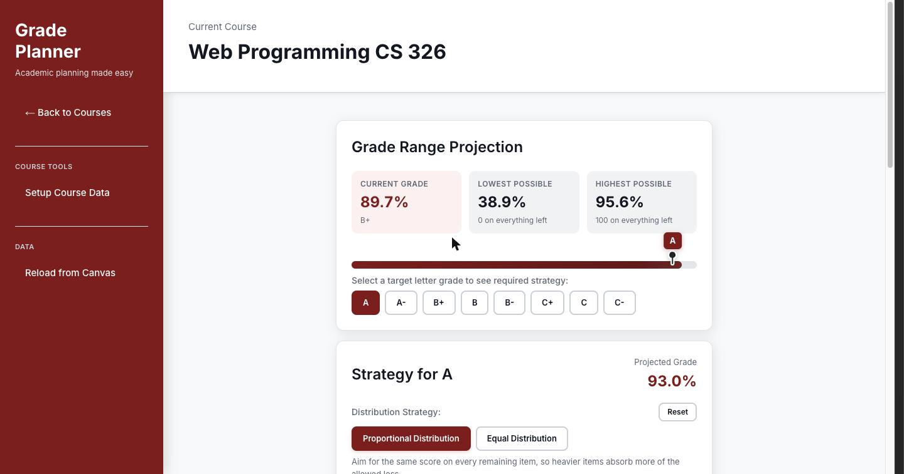
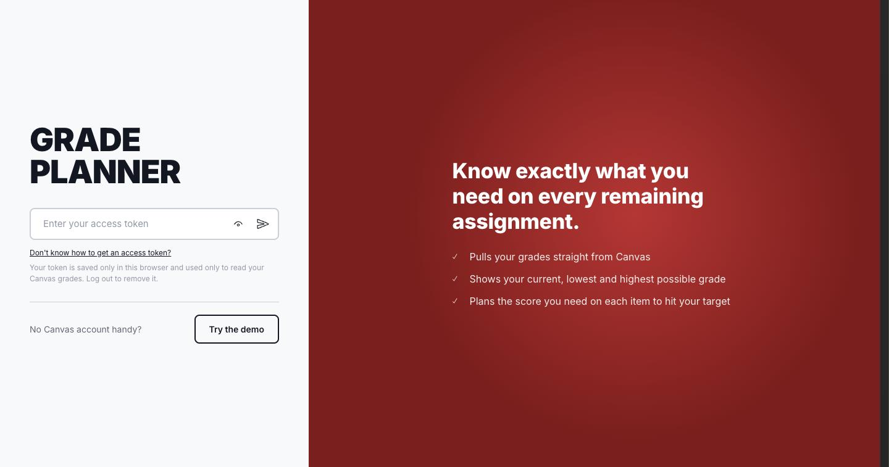
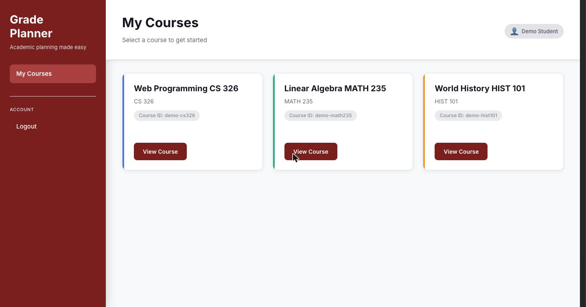
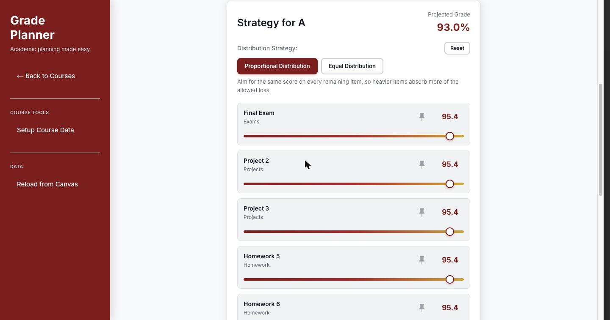
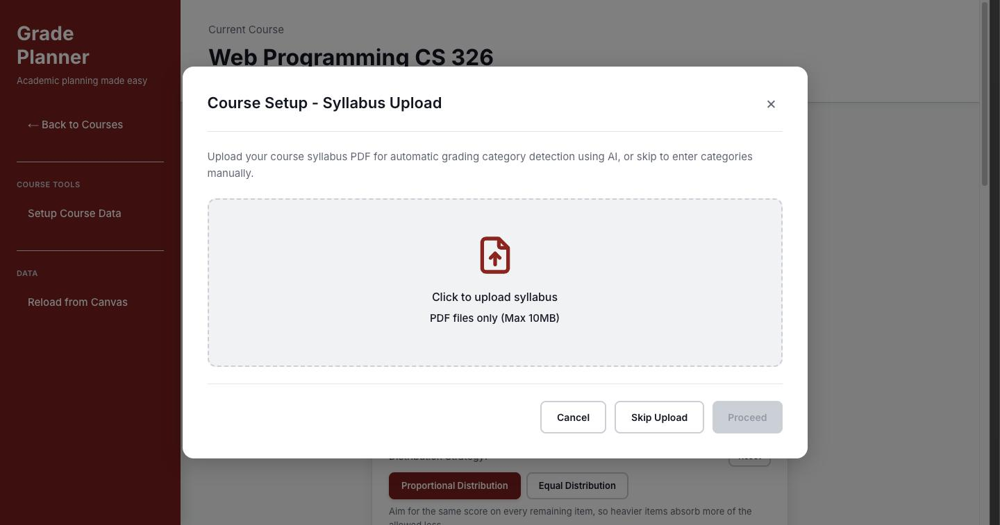
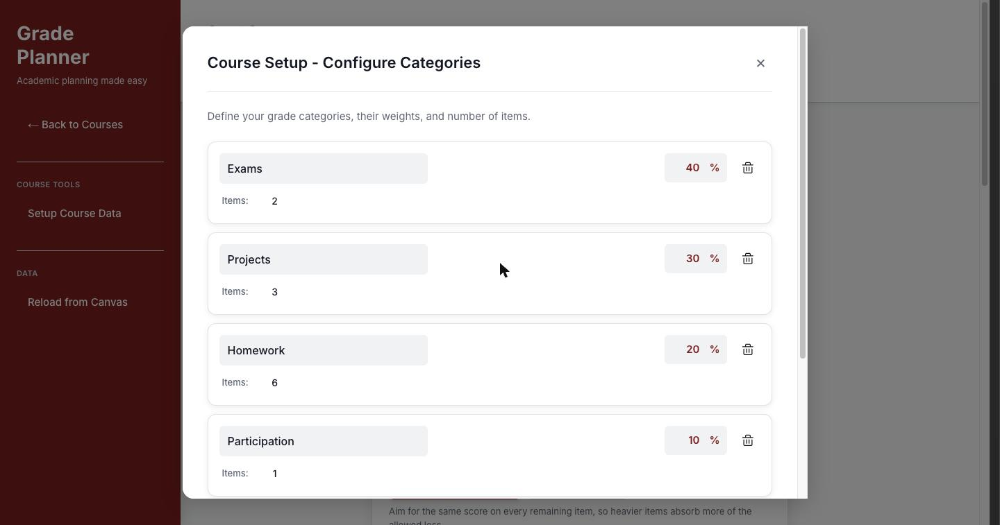
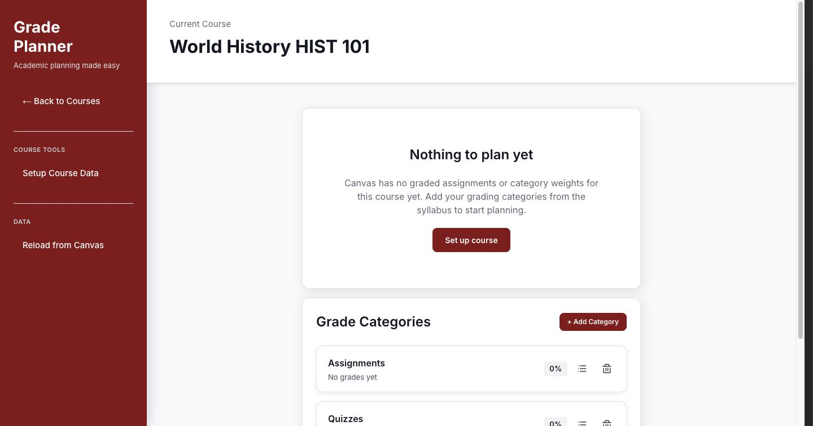
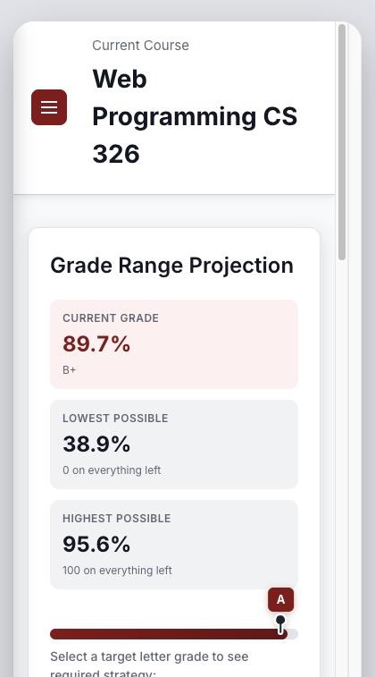
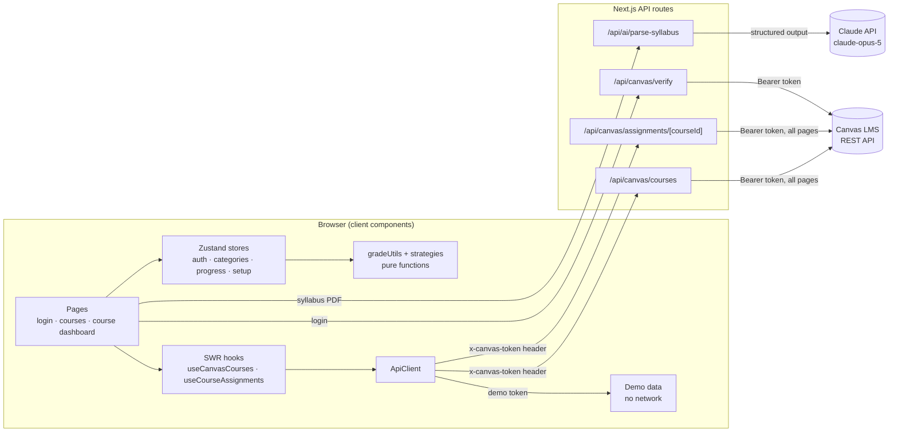
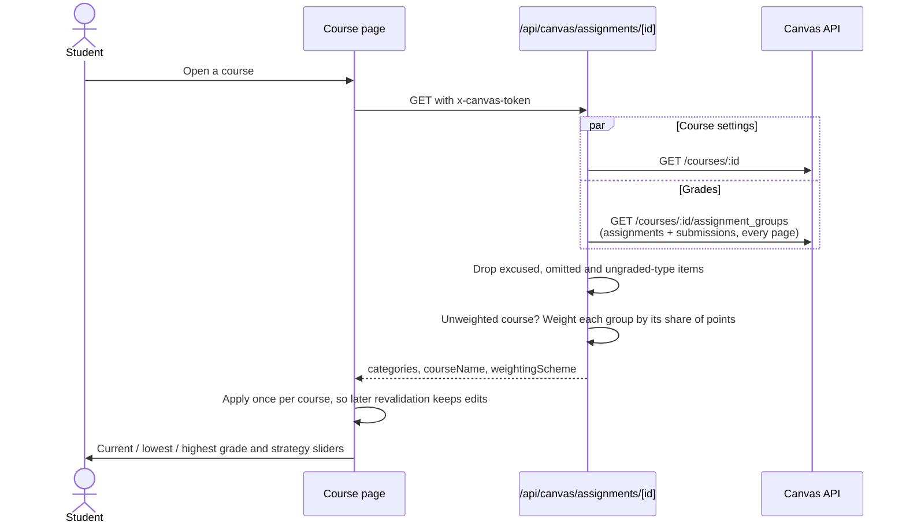

# Canvas Grade Planner

> Connect your Canvas LMS account and see exactly what you need on every remaining assignment to reach the grade you want.

[](https://nextjs.org/)
[](https://www.typescriptlang.org/)
[](#testing)
[](#team)



Canvas tells you your current grade. It doesn't tell you what you need on the final to get an A, or whether an A is even still possible. Grade Planner pulls your real grades from Canvas, works out the best and worst case, and splits the points you can still afford to lose across your remaining assignments.

**No Canvas account? Click _Try the demo_ on the login page.** It loads three sample courses and never touches the network.

## Features

- **Canvas integration.** Paste a personal access token and your active courses, assignment groups and scores load automatically.
- **Works with both Canvas grading modes.** Courses that use weighted assignment groups and courses graded by total points are both calculated the way Canvas does, with items weighted by their point value.
- **Grade range at a glance.** Current grade, the lowest possible (0 on everything left) and the highest possible (100 on everything left).
- **Target strategy.** Pick a letter grade to get a required score for each remaining item. Two distribution strategies are available, and you can drag or pin individual sliders while the rest rebalance.
- **AI syllabus import.** Upload a syllabus PDF and Claude extracts the grading categories, weights and item counts. Syllabus weights fill in what Canvas is missing.
- **Your edits stick.** Scores and categories you change are kept until you explicitly reload from Canvas.
- **Demo mode** for trying the app without a Canvas account.

## Screenshots

| Sign in or try the demo | Your courses |
| --- | --- |
|  |  |

| Required score per remaining item | A points-based course |
| --- | --- |
|  |  |

| Syllabus upload | Category setup |
| --- | --- |
|  |  |

| Course with nothing to plan yet | Mobile |
| --- | --- |
|  |  |

## Architecture

The app is a Next.js 14 App Router project. Everything the user sees is a client component; the server side is a thin set of API routes that proxy Canvas (so the browser never hits Canvas CORS rules) and call Claude for syllabus parsing. All grade math is pure TypeScript with no framework dependencies, which is what the unit tests cover.



### Loading a course



### How the math works

- **Item weights.** Within a category, each item's share of the category weight is proportional to its points possible, matching Canvas. Zero-point items carry no weight. Items created by hand (no point value) split the category evenly.
- **Points-based courses.** When a course doesn't use weighted assignment groups, each group's weight is its share of all points possible, so the final percentage equals total earned over total possible.
- **Allowed loss.** `highest possible − target threshold` is the number of grade points you can still give up. A strategy decides where that loss goes:
  - **Proportional Distribution** aims for the same score on every remaining item.
  - **Equal Distribution** gives up the same number of grade points on each item, so small items can drop to 0.
- **Attendance items** are all-or-nothing, so the required count is rounded up and the surplus is redistributed to the other items.

## Project structure

```
GradePlanner/
├── app/
│   ├── page.tsx                       # Login + "Try the demo"
│   ├── courses/page.tsx               # Course list
│   ├── courses/[courseId]/page.tsx    # Course dashboard
│   ├── api/canvas/…                   # Canvas proxy routes
│   ├── api/ai/parse-syllabus/         # Claude syllabus extraction
│   ├── stores/                        # Zustand: auth, categories, progress, setup
│   └── types/strategy.ts              # Distribution strategies
├── components/                        # Dashboard, setup modal, shared UI
├── hooks/useCanvasApi.ts              # SWR data hooks
├── lib/
│   ├── api/client.ts                  # Fetch wrapper (serves demo data locally)
│   ├── calculations/gradeUtils.ts     # Grade math (unit tested)
│   ├── canvas/                        # Canvas client, types, response mapping
│   └── demo/data.ts                   # Sample courses for demo mode
└── __tests__/                         # Vitest suites
```

## Getting started

Requires Node.js 18 or newer.

```bash
git clone https://github.com/youngh82/HackUmass-XIII.git
cd HackUmass-XIII/GradePlanner
npm install
cp .env.local.example .env.local   # add CLAUDE_API_KEY for syllabus import
npm run dev
```

Open http://localhost:3000, then either paste a Canvas token or click **Try the demo**.

| Variable | Needed for |
| --- | --- |
| `CLAUDE_API_KEY` | Syllabus PDF import. Everything else works without it. |

The Canvas URL is currently set to UMass Amherst (`app/page.tsx`). Point `CANVAS_BASE_URL` at your institution's `https://<school>.instructure.com/api/v1` to use another school.

### Getting a Canvas token

In Canvas, go to **Account → Settings → Approved Integrations → + New Access Token**, give it a purpose, then copy the generated token.

## Scripts

| Command | What it does |
| --- | --- |
| `npm run dev` | Start the dev server |
| `npm run build` | Production build |
| `npm run lint` | ESLint (`next/core-web-vitals`) |
| `npm test` | Vitest in watch mode (`npx vitest run` for a single pass) |

## Testing

The 19 Vitest tests cover the parts where a bug would give a student a wrong number:

- point-weighted item and category averages, including zero-point items
- current, lowest and highest possible grade
- both distribution strategies, and that their labels match what they calculate
- the demo courses (weights total 100%, the sample B+ course computes to 89.67%)

Calculations were also checked against real Canvas data during development: for a points-based course the planner's 85.2% matched the raw earned/possible total of 85.19%.

## Security and privacy

- The Canvas token is kept in the browser's `localStorage` and sent only to this app's own API routes, which forward it to Canvas. The server never stores it. **Logout** removes it.
- A 401 from Canvas on the course list logs you out. A denied single course (for example, one you dropped) shows an explanation and keeps you signed in.
- Syllabus PDFs are sent to the Claude API for extraction and are not stored.

## Post-hackathon improvements

The first version was built in 24 hours at HackUMass XIII. A later review pass ran the app against a real Canvas account and fixed what it found:

- **Points-based courses showed 0%.** Every real course tested graded by total points, which the app didn't support. It now reads Canvas's weighting setting and derives weights from points.
- **Items within a category were weighted equally** instead of by points; category averages disagreed with the grade calculation.
- **Strategy labels were swapped**, and a duplicate "Custom" strategy was removed.
- **Background refetches erased user edits**, and confirming setup wiped Canvas scores.
- **Canvas lists were cut off at 10 items** (no pagination).
- Added the grade summary tiles, an empty state, demo mode, accessibility fixes (keyboard-reachable dialogs, Escape to close, pinch zoom), ESLint and unit tests, and moved syllabus parsing to Claude structured outputs.

## Roadmap

- Canvas "drop lowest/highest" group rules
- Configurable Canvas institution URL in the UI
- Hide non-academic Canvas courses
- Export a grade plan

## Team

Built at **HackUMass XIII** (2025) by:

- [Eungyu Shim](https://github.com/eungyuShim)
- [Jongchan](https://github.com/xxjcpark)
- [Jooyoung](https://github.com/youngh82)
